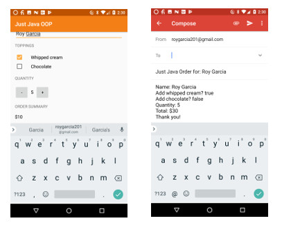

# Just Java 

This is a repository of a project that I created for a Udacity course. Along with learning the concepts of Object Oriented Programming, this project builds on top of the Just Java app that was created earlier to practice on Android Layout [Github Just Java Project repo](https://github.com/roylouislgarcia/justJava.git) 

In accordance to the MVC (Model View Control) paradigm, the behavior of the objects based on logic and conditionals are used to update the Just Java App to incorporate OOP principles and more advance Android concepts of Inheritence, casting, Intent, etc.

### Prerequisites

1. I had been following the lectures to make an interactive android app as part of Udacity's Grow With Google Challenge Scholarship: Android Basics [Udacity](https://www.udacity.com/grow-with-google)
2. Download this repository and use Android Studio IDE to create the project locally.

### Screenshot of the project

## Author

Roy Louis L. Garcia

